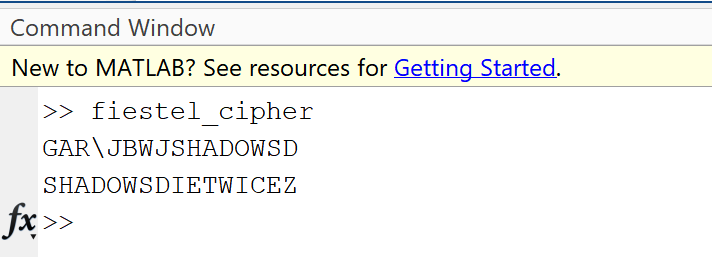
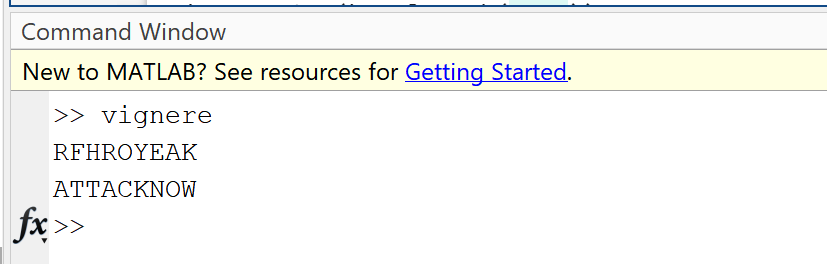
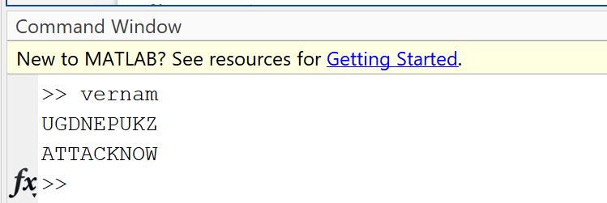

# Cryptography

Cryptographic algorithms implemented in MATLAB, including classical ciphers, modern techniques, and supporting functions like encryption/decryption, cryptanalysis, and mathematical utilities such as Euclidean algorithms and fast exponentiation. Presented below are a few selected cryptographic techniques.

---

## Feistal Cipher

```matlab
clear all;
text='SHADOWSDIETWICE';
text=upper(text);

if(mod(length(text),2)~=0)
    text=text+"Z";
    text=char(text);
end

lefthalf=text(1:length(text)/2);
righthalf=text(length(text)/2+1:length(text));

cipherrighthalf=lefthalf;
key=randperm(26,length(text)/2);

righthalf=double(righthalf)-64;
cipherlefthalf=bitxor(righthalf,key);
ciphertext=string(char(cipherlefthalf+64))+cipherrighthalf;
disp(ciphertext);

%Decryption
ciphertext=char(ciphertext);
lefthalf=ciphertext(1:length(ciphertext)/2);
righthalf=ciphertext(length(ciphertext)/2+1:length(ciphertext));

decipherleft=righthalf;
lefthalf=double(lefthalf)-64;
decipherright=bitxor(lefthalf,key);
deciphertext=decipherleft+string(char(decipherright+64));
disp(deciphertext);
```
>Explanation: -

- This program executes a basic encryption and decryption system. It first converts the string "SHADOWSDIETWICE" to uppercase. If the length of the string is odd, it appends a "Z" to the end to make it even. The string is then divided into two equal halves. During encryption, the right half is used as the left half of the cipher, and the left half is XOR-encrypted using a random key to create the right half of the cipher. The encryption operation swaps and reorders the halves. During decryption, the reverse is done - the right half of the ciphertext is used as the left half of the plaintext, and the left half of the ciphertext is XOR-decrypted using the same key to obtain the right half of the plaintext. This method employs bitwise XOR operations and char-to-numeric conversions, where each character is represented by its position in the alphabet (A=1, B=2, etc.) plus 64 for ASCII mapping. The program prints the encrypted string and the decrypted result, which will be the same as the initial input.

>Output Image: -



---

## Hill Cipher

```matlab
clc;
clear all;
close all;
text='ATTACKNOW';
n=2;
while(mod(length(text),n)~=0)
    text=text+"Z";
    text=char(text);
end
%Encryption
key=[2 1; 3 4];
text=reshape(text,[length(text)/n,n]);
text1=transpose(text);
text1=double(text1)-65;
ciphertext=mod(key*text1,26);
ciphertext=char(ciphertext+65);
ciphertext=transpose(ciphertext);
ciphertext=reshape(ciphertext,1,[]);
disp("Encrypted text: " + ciphertext);

%Decryption
% Calculate inverse of key matrix manually without using adjoint
det_key = mod((key(1,1)*key(2,2) - key(1,2)*key(2,1)), 26);

% Find modular multiplicative inverse of determinant
k2 = 0;
for i=1:1:25
    if mod(det_key*i, 26) == 1
        k2 = i;
        break;
    end
end

% Calculate the adjugate matrix (often called adjoint) manually
adjugate = [key(2,2), -key(1,2); -key(2,1), key(1,1)];
% Ensure negative values are properly handled in modulo 26
adjugate = mod(adjugate + 26, 26);

% Calculate the inverse key matrix
key_inverse = mod(k2 * adjugate, 26);

% Reshape ciphertext for decryption
ciphertext_reshape = reshape(ciphertext, [length(ciphertext)/n, n]);
ciphertext_transpose = transpose(ciphertext_reshape);
ciphertext_num = double(ciphertext_transpose) - 65;

% Decrypt the message
deciphertext = mod(key_inverse * ciphertext_num, 26);
deciphertext = char(deciphertext + 65);
deciphertext = transpose(deciphertext);
deciphertext = reshape(deciphertext, 1, []);
disp("Decrypted text: " + deciphertext);
```
>Explanation: -

- Hill cipher, a polygraphic substitution cipher, is a very old one that employs linear algebra to encrypt and decrypt. It starts with the plaintext "ATTACKNOW" and makes its length divisible by 2 (n's value) by adding "Z" characters as and when necessary. For encryption, the text is rearranged into a matrix of n columns, transposed, and then converted to numbers (A=0, B=1, etc.). This numerical form is then multiplied with a 2×2 key matrix [2,1;3,4] and reduced modulo 26 and then converted back to letters.
-  The decryption algorithm discovers a unique number known as the modular inverse of the key matrix in a small set of integers that cycles after 26. It computes the determinant and its modular multiplicative inverse initially. It then computes the adjugate matrix and multiplies it by this inverse to obtain the inverse matrix of the key. The ciphertext is also put through the same transformations and conversions before it is multiplied by this inverse key matrix to obtain the original message again. The encrypted and decrypted messages are both displayed, with the decryption algorithm reversing the encryption to obtain the original plaintext again.

>Output Image: -


---

## Vigenère Cipher

```matlab
text="ATTACKNOW";
key=round(rand(1)*26);

key=char(key+65)+text;
key=char(key);
text=char(text);
ciphertext=text;
for i=1:length(text)
    a=double(text(i))-65;
    b=double(key(i))-65;
    ciphertext(i)=char(mod(a+b,26)+65);
end
disp(ciphertext);
%Decryption

deciphertext=ciphertext;
for i=1:length(ciphertext)
    a=double(ciphertext(i))-65;
    b=double(key(i))-65;
    deciphertext(i)=char(mod(a-b,26)+65);
end
disp(deciphertext);
```
>Explanation: -

- This program employs the Vigenère cipher, an interesting method of encryption using a chain of Caesar ciphers woven together. We begin with the plaintext "ATTACKNOW," from which we generate a key beginning with a random letter and smoothly followed by the plaintext itself. During encryption, the plaintext letter is mapped to its numeric equivalent (A=0, B=1, etc.), added to the numeric value of the corresponding key letter, and then taken modulo 26 to ensure it remains within the range of the alphabet and finally mapped to a letter.
-  The decryption process undoes the encryption by subtracting the value of the key letter from the value of the ciphertext letter using modulo 26 (with appropriate handling for negative outcomes) and then converting it back into a letter. The use of modular arithmetic makes sure that "wrapping" only happens when crossing over Z or before A. The encrypted and decrypted messages are both shown, with the decryption process successfully restoring the original message "ATTACKNOW". This is a simple example of a classic polyalphabetic substitution cipher that is better than simple substitution because it uses multiple substitution alphabets.

>Output Image: -



---

## Vernam Cipher

```matlab
text='ATTACKNOW';
key=randperm(26,length(text));

text=double(text)-65;
ciphertext=bitxor(text,key);
%ciphertext=mod(ciphertext,26);
ciphertext=char(ciphertext+65);
disp(ciphertext);
%Decryption

ciphertext=double(ciphertext)-65;
deciphertext=ciphertext;
for i=1:length(ciphertext)
    deciphertext(i)=bitxor(key(i),ciphertext(i));
end
%deciphertext=mod(deciphertext,26);
deciphertext=char(deciphertext+65);
disp(deciphertext);
```
>Explanation: -

- This program generates a basic XOR cipher for encrypting and decrypting text. It begins with the plaintext "ATTACKNOW" and generates a random key of the same length, consisting of numbers 1 to 26 without repetition. The plaintext is converted to numbers (A=0, B=1, etc.), and each character is XOR-encrypted with the corresponding number from the key using the bitwise XOR technique.
-  To encrypt, the number of each letter is combined with its corresponding key number by XOR, and then converted back to a letter. The decryption is done the same way by applying the same XOR operation to the encrypted message with the same key numbers. This is possible because XOR is reversible - applying it twice with the same key restores the original value. The code displays both the encrypted output and the decrypted message, which is identical to the original input "ATTACKNOW". This technique employs the symmetric nature of XOR operations such that (A XOR B) XOR B = A, and so it is an easy and efficient method to encrypt when the key remains secret.

>Output Image: -


