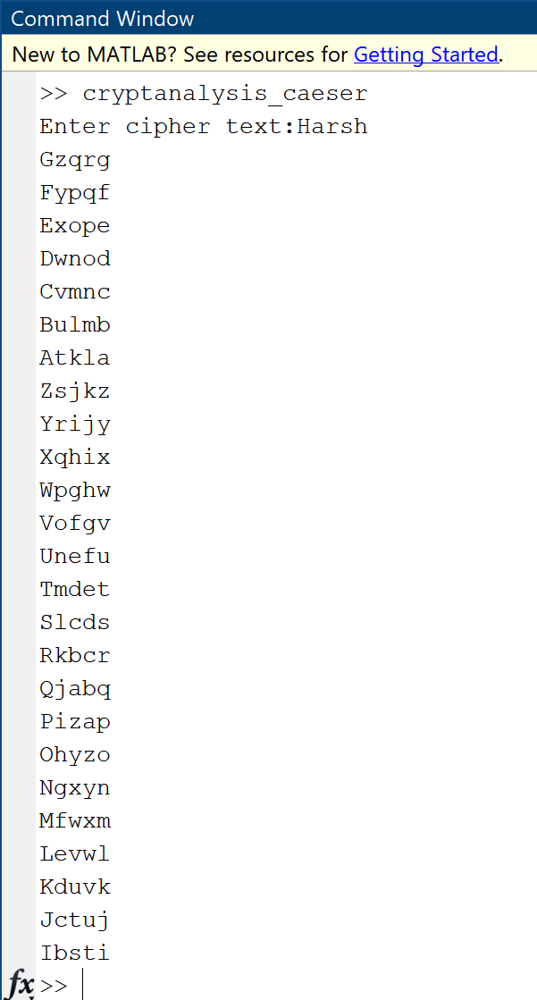

# Cryptography

Cryptographic algorithms implemented in MATLAB, including classical ciphers, modern techniques, and supporting functions like encryption/decryption, cryptanalysis, and mathematical utilities such as Euclidean algorithms and fast exponentiation.

---

## Caesar Cipher Cryptanalysis

```matlab
cipher=input("Enter cipher text:",'s');
for offset=1:25
    deciphertext=cipher;  % Changed ciphertext to cipher
    for i=1:length(cipher)  % Changed text to cipher
        temp = double(cipher(i));  % Changed ciphertext to cipher
        if(temp>=65 && temp<=90)
            %Converting character into ASCII value
            currascii=temp-65;
            %Shifting values by offset
            encryascii=mod(currascii-offset,26);
            %Converting ASCII value back into character
            deciphertext(i)=char(encryascii+65);
        elseif(temp>=97 && temp<=122)  % Added elseif condition to check lowercase range
            currascii=double(cipher(i))-97;  % Changed ciphertext to cipher
            encryascii=mod(currascii-offset,26);
            %Converting ASCII value back into character
            deciphertext(i)=char(encryascii+97);
        else  % Keep non-alphabetic characters unchanged
            deciphertext(i)=cipher(i);  % Changed ciphertext to cipher
        end
    end
    disp(deciphertext);
end
```
>Explanation: -

- The MATLAB code provided is a simple implementation of a Caesar cipher decryption algorithm. It prompts the user to input encrypted text and then attempts to decrypt it by shifting each letter back by each possible offset from 1 to 25. The code checks each character to determine if it's an uppercase or lowercase letter and then shifts its ASCII value by the offset. Non-alphabetic characters remain unchanged. After processing each character, the decrypted text is displayed for each offset.

>Output Image: -

